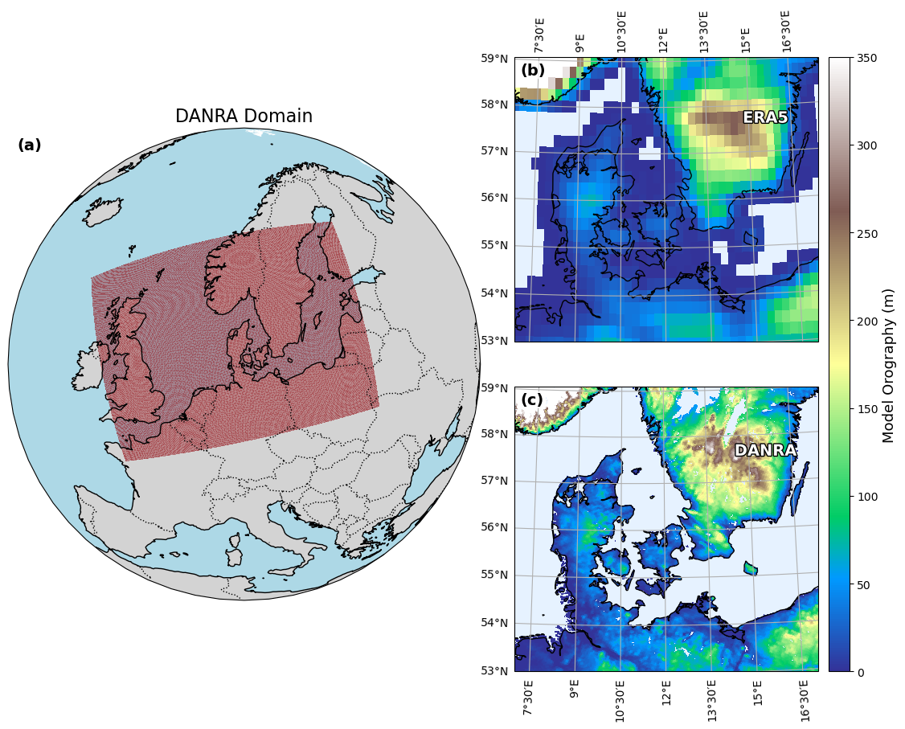

# Model Specifications
## Model Grid and Domain
DANRA is produced on a Lambert Conformal grid with a horizontal resolution of 2.5 km, covering a domain of 800 x 600 grid points, including an 11-point extension zone. As a result, output is available on a 789 x 589 horizontal grid. The vertical resolution consists of 65 hybrid sigma/pressure levels.



## Boundary Conditions
The boundary conditions for the DANRA reanalysis are derived from the ECMWF Global Reanalysis (ERA5) dataset, which provides global atmospheric data at a resolution of approximately 31 km. Note: Due to the coupling to coarse-resolution lateral boundary conditions, the performance of DANRA near the boundaries is expected to be overall worse than in the interior of the domain.

## Coordinate Reference System (CRS)
The DANRA dataset uses a Lambert Conic Conformal projection with the following specifications:

### CRS WKT
```
PROJCRS["DMI HARMONIE DANRA lambert projection",
    BASEGEOGCRS["DMI HARMONIE DANRA lambert CRS",
        DATUM["DMI HARMONIE DANRA lambert datum",
            ELLIPSOID["Sphere", 6367470, 0,
                LENGTHUNIT["metre", 1, ID["EPSG", 9001]]
            ]
        ],
        PRIMEM["Greenwich", 0,
            ANGLEUNIT["degree", 0.0174532925199433, ID["EPSG", 8901]]
        ],
        ID["EPSG",4035]
    ],
    CONVERSION["Lambert Conic Conformal (2SP)",
        METHOD["Lambert Conic Conformal (2SP)", ID["EPSG", 9802]],
        PARAMETER["Latitude of false origin", 56.7,
            ANGLEUNIT["degree", 0.0174532925199433, ID["EPSG", 8821]]
        ],
        PARAMETER["Longitude of false origin", 25,
            ANGLEUNIT["degree", 0.0174532925199433, ID["EPSG", 8822]]
        ],
        PARAMETER["Latitude of 1st standard parallel", 56.7,
            ANGLEUNIT["degree", 0.0174532925199433, ID["EPSG", 8823]]
        ],
        PARAMETER["Latitude of 2nd standard parallel", 56.7,
            ANGLEUNIT["degree", 0.0174532925199433, ID["EPSG", 8824]]
        ],
        PARAMETER["Easting at false origin", 0,
            LENGTHUNIT["metre", 1, ID["EPSG", 8826]]
        ],
        PARAMETER["Northing at false origin", 0,
            LENGTHUNIT["metre", 1, ID["EPSG", 8827]]
        ]
    ],
    CS[Cartesian, 2],
    AXIS["(E)", east, ORDER[1],
        LENGTHUNIT["metre", 1, ID["EPSG", 9001]]
    ],
    AXIS["(N)", north, ORDER[2],
        LENGTHUNIT["metre", 1, ID["EPSG", 9001]]
    ],
    USAGE[
        AREA["Denmark and surrounding regions"],
        BBOX[47, -3, 65, 25],
        SCOPE["Danra reanalysis projection"]
    ]
]
```

## DANRA production streams
DANRA has produced in several production streams. Each stream has an associated warm-up period of 1 year, during which the model is initialized and stabilized. The reanalysis period for each stream is listed in the table below. Warm-up data is not included in the dataset, and the reanalysis period starts after the warm-up period. The use of a warm-up period is essential to ensure that the model reaches a stable state before the reanalysis data is considered valid.

### DANRA stream overview
| Stream | Reanalysis period |
|-----------|-------------|
| 1989 | 1990.09.01 - 1994.08.30 |
| 1993 | 1994.09.01 - 1998.08.30 |
| 1997 | 1998.09.01 - 2002.08.30 |
| 2001 | 2002.09.01 - 2006.08.30 |
| 2005 | 2006.09.01 - 2010.08.30 |
| 2009 | 2010.09.01 - 2014.08.30 |
| 2013 | 2014.09.01 - 2017.08.30 |
| 2016 | 2017.09.01 - 2019.11.30 |
| 2018 | 2019.12.01 - 2023.12.31 |